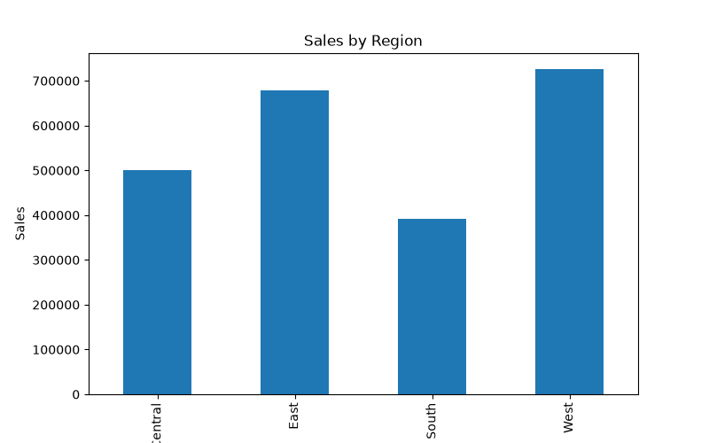
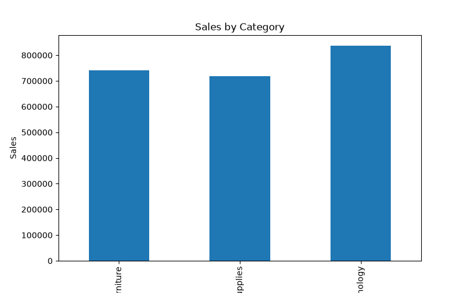
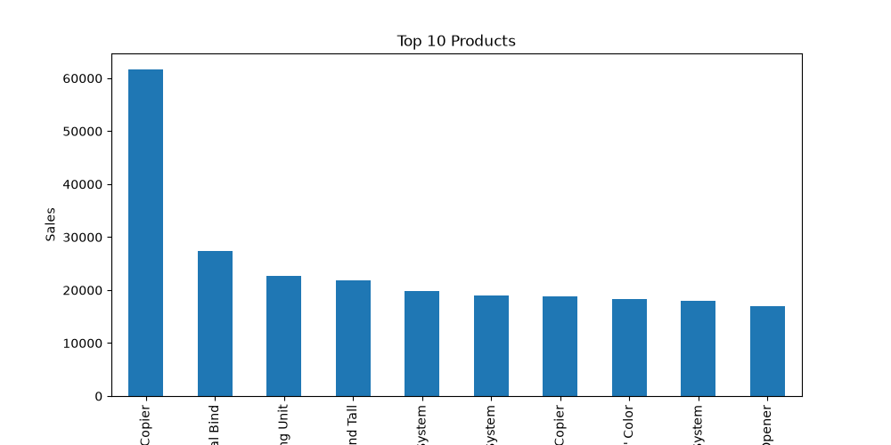

# SQL Sales Performance Analysis

## Overview

This project focuses on analyzing sales transaction data using SQL and Python-based analytics techniques to generate actionable business insights. The analysis evaluates revenue trends, customer purchasing behavior, product performance, and regional sales distribution to support data-driven decision-making.

The project combines SQL querying, data analysis, and visualization techniques to identify key business patterns and performance indicators.

---

## Business Problem

Organizations generate large volumes of sales data every day. Extracting meaningful insights from this data is essential for improving profitability, understanding customer behavior, and optimizing business operations.

This project addresses the following questions:

* Which regions generate the highest revenue?
* Which customers contribute the most sales?
* What are the top-performing products?
* Which categories drive business growth?
* How can sales performance be measured using KPIs?

---

## Features

* Revenue Analysis
* Customer Behavior Analysis
* Product Performance Analysis
* Regional Sales Analysis
* Category-Wise Performance Evaluation
* Business Intelligence Reporting
* SQL Query Development
* Data Visualization
* KPI Generation

---

## Technologies Used

| Technology      | Purpose                    |
| --------------- | -------------------------- |
| SQL             | Data querying and analysis |
| Oracle Database | Database management        |
| Python          | Data processing            |
| Pandas          | Data analysis              |
| Matplotlib      | Data visualization         |
| Excel/CSV       | Dataset storage            |

---

## Dataset

**Dataset:** Sample Superstore Dataset

The dataset contains:

* Customer Information
* Product Information
* Order Details
* Sales Records
* Profit Data
* Regional Information
* Category and Sub-Category Details

### Key Columns

* Order ID
* Customer Name
* Region
* Category
* Product Name
* Sales
* Profit
* Quantity

---

## Project Workflow

### 1. Data Collection

Collected sales transaction records from the Sample Superstore Dataset.

### 2. Data Preparation

* Data loading
* Data validation
* Data cleaning
* Structure verification

### 3. SQL Query Development

Developed SQL queries for:

* Revenue Analysis
* Profit Analysis
* Customer Analysis
* Product Analysis
* Regional Analysis

### 4. Business Analytics

Generated insights related to:

* Sales performance
* Customer spending behavior
* Product popularity
* Regional revenue contribution

### 5. Data Visualization

Created visual reports for business stakeholders.

---

## SQL Analysis

### Revenue Analysis

```sql
SELECT ROUND(SUM(sales),2)
FROM sales;
```

### Customer Analysis

```sql
SELECT customer_name,
       ROUND(SUM(sales),2)
FROM sales
GROUP BY customer_name
ORDER BY SUM(sales) DESC;
```

### Product Performance Analysis

```sql
SELECT product_name,
       ROUND(SUM(sales),2)
FROM sales
GROUP BY product_name
ORDER BY SUM(sales) DESC;
```

### Regional Sales Analysis

```sql
SELECT region,
       ROUND(SUM(sales),2)
FROM sales
GROUP BY region;
```

---

## Results

### Sales by Region



The regional analysis highlights revenue distribution across different business regions and identifies high-performing markets.

---

### Sales by Category



Category-level analysis helps identify which product categories contribute most to overall sales performance.

---

### Top Products Analysis



Top-performing products were identified based on total sales revenue generated.

---

## Key Business Insights

### Customer Insights

* Identified high-value customers contributing significantly to total revenue.
* Analyzed customer spending patterns.

### Product Insights

* Determined top-performing products based on sales.
* Evaluated category-wise business contribution.

### Regional Insights

* Compared regional revenue performance.
* Identified high-performing sales regions.

### Strategic Insights

* Revenue concentration observed among top customers.
* Product performance varies significantly across categories.
* Regional sales patterns can guide business expansion strategies.

---

## Performance Metrics

| Metric             | Status    |
| ------------------ | --------- |
| Revenue Analysis   | Completed |
| Customer Analysis  | Completed |
| Product Analysis   | Completed |
| Category Analysis  | Completed |
| Regional Analysis  | Completed |
| KPI Reporting      | Completed |
| Data Visualization | Completed |

---

## Project Structure

```text
SQL-Sales-Performance-Analysis/
│
├── data/
│   └── Sample - Superstore.csv
│
├── sql/
│   ├── create_table.sql
│   ├── sales_queries.sql
│   └── advanced_queries.sql
│
├── src/
│   ├── sales_analysis.py
│   └── visualization.py
│
├── results/
│   ├── sales_by_region.png
│   ├── sales_by_category.png
│   ├── top_products.png
│   └── kpi_report.txt
│
├── README.md
├── requirements.txt
└── .gitignore
```

---

## Applications

* Sales Performance Monitoring
* Business Intelligence Reporting
* Revenue Analysis
* Customer Analytics
* Product Analytics
* Strategic Business Planning

---

## Author

**Panjala Shambhavi**

B.Tech Artificial Intelligence & Machine Learning (AIML)

---

## Future Enhancements

* Interactive Power BI Dashboard
* Real-Time Sales Monitoring
* Customer Segmentation Analysis
* Sales Forecasting Models
* Advanced KPI Dashboard
